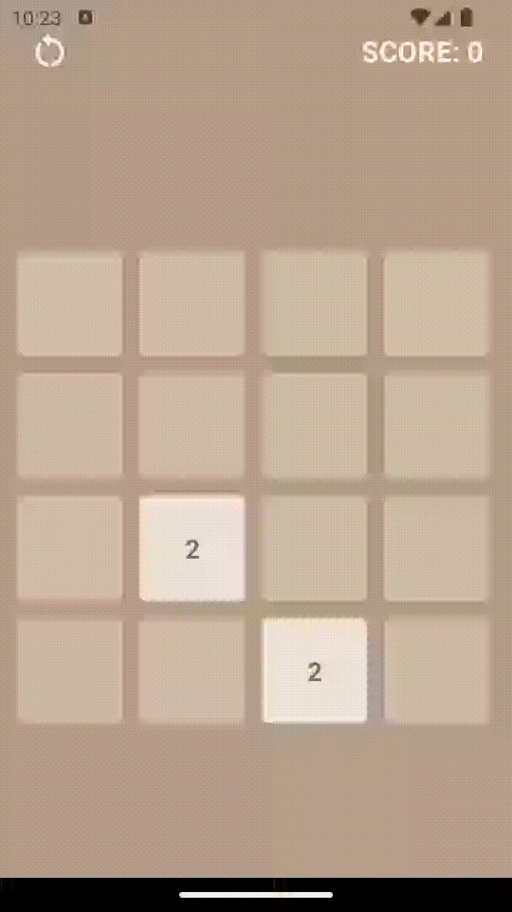

# 2048

## Overview
The 2048 Game is a popular single-player puzzle game created in 2014. The objective of the game is to slide numbered tiles on a grid to combine them to create a tile with the number 2048. This project is my attempt to recreate it.

## Features
- Classic 4x4 grid
- Responsive design
- Smooth animations
- Score tracking

## How to Play
- Move tiles in 4 directions (for web app use mouse to drag them).
- When two tiles with the same number collide, they merge into one with the sum of their values.
- The goal is to create a tile with the number 2048.
- The game ends when there are no empty spaces and no possible moves left.

Enjoy the game and have fun!

